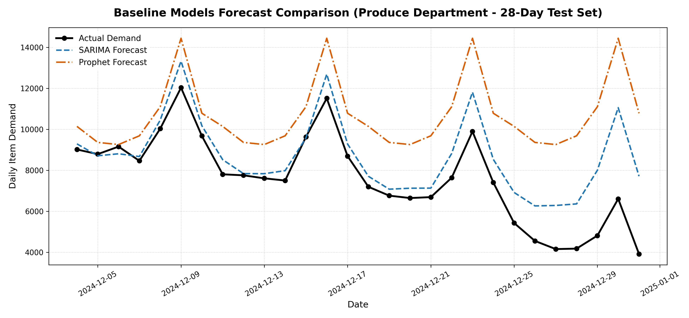
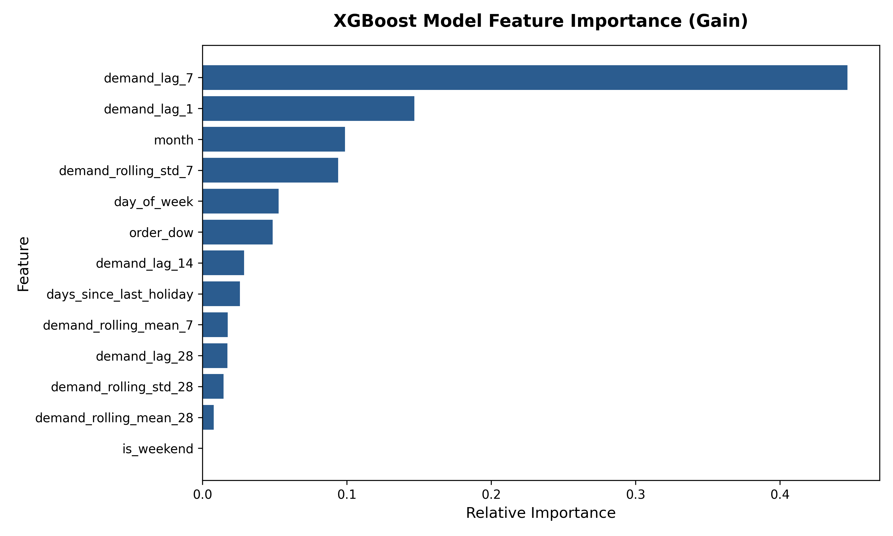
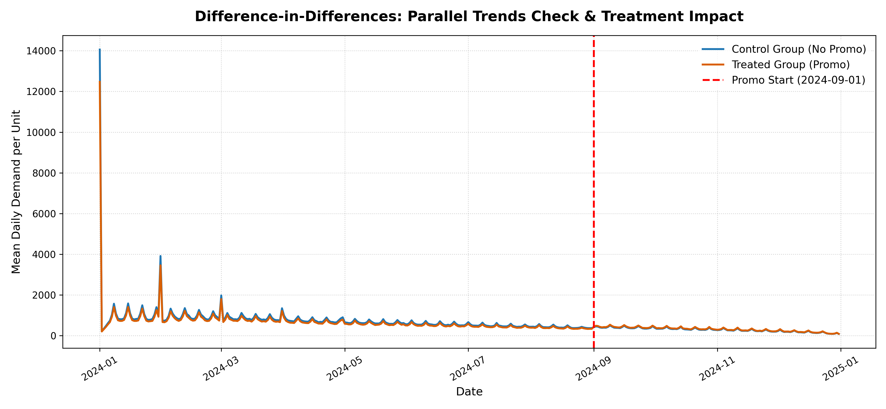
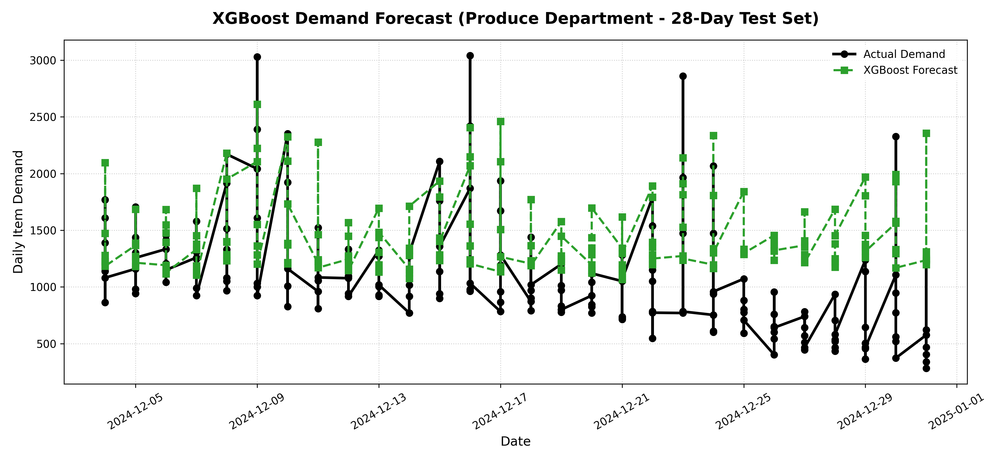
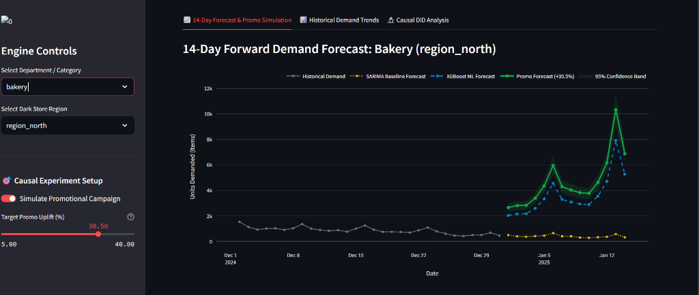
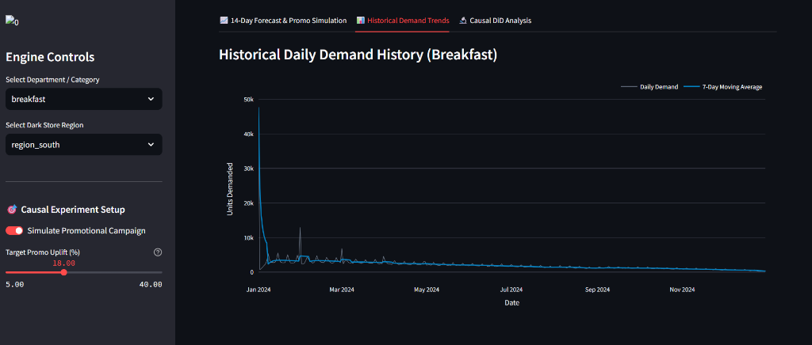
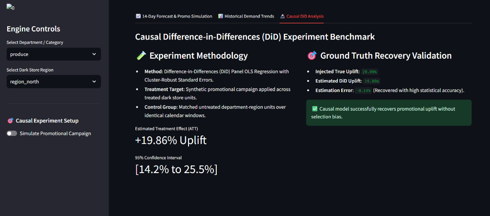
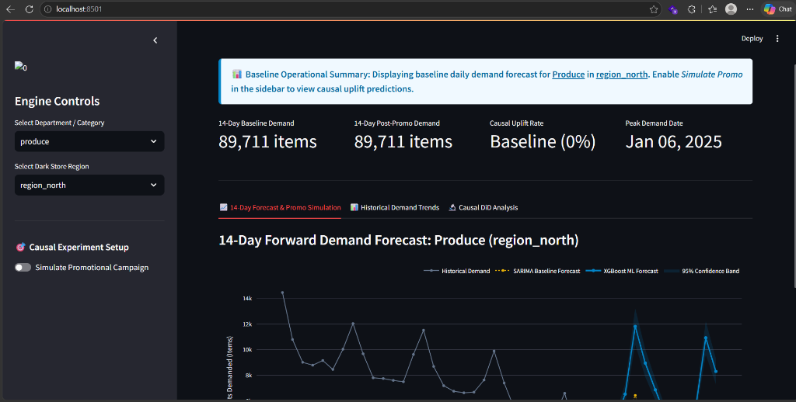

# ⚡ Dark Store Demand Forecasting & Causal Intelligence

An end-to-end **ML + Causal Inference** project that forecasts daily item-level demand for dark store (quick-commerce) fulfillment centers across 21 product departments, and uses **Difference-in-Differences (DiD)** causal inference to measure the true incremental impact of promotional campaigns — separating real uplift from organic trends.

---

## 1. Problem Statement

Dark stores need accurate next-day demand forecasts to decide how much inventory to pre-position at each micro-fulfillment center. **Over-forecasting** locks up working capital in unsold perishables; **under-forecasting** causes stock-outs and lost orders. Beyond forecasting, operations teams need a rigorous way to measure whether a promotional campaign *actually* increased demand or merely coincided with an organic uptick — a question that pure prediction models cannot answer.

---

## 2. Data Source & Description

| Attribute | Detail |
|---|---|
| **Source** | [Instacart Market Basket Analysis](https://www.kaggle.com/datasets/psparks/instacart-market-basket-analysis/data) (Kaggle) |
| **Raw Records** | **33.8M** order-product items across **3.4M** orders |
| **Departments** | 21 categories (produce, dairy, bakery, alcohol, etc.) |
| **Temporal Coverage** | Synthetic daily calendar mapped to Jan 2024 – Dec 2024 (366 days) |
| **Processed Output** | **53,802** daily demand records at `(date × department × day_of_week)` granularity |

**Raw files ingested:**
- `orders.csv` — order metadata (user, DOW, hour, days since prior order)
- `order_products__prior.csv` + `order_products__train.csv` — item-level transaction logs
- `products.csv`, `aisles.csv`, `departments.csv` — product taxonomy

---

## 3. Approach — Forecasting Methodology

### Pipeline Overview

```
Raw CSVs → data_loader.py → daily_demand.parquet
                              ↓
                     build_features.py → features.parquet
                              ↓
              baseline_forecast.py (SARIMA / Prophet)
              xgboost_forecast.py  (XGBoost + engineered features)

```
## Project Structure

```
dark-store-demand/
├── data/
│   ├── raw/                          # Instacart CSV files (not tracked in git)
│   └── processed/                    # Parquet outputs (daily_demand, features, promo simulation)
├── models/                           # Serialized model artifacts (.pkl) + metrics (.json)
├── reports/                          # Generated plots and dashboard screenshots
├── src/
│   ├── config.py                     # Project paths configuration
│   ├── data_loader.py                # Raw data ingestion & daily demand aggregation
│   ├── features/
│   │   └── build_features.py         # Lag, rolling, calendar, holiday feature engineering
│   ├── models/
│   │   ├── baseline_forecast.py      # SARIMA + Prophet baselines
│   │   └── xgboost_forecast.py       # XGBoost with TimeSeriesSplit CV tuning
│   ├── causal/
│   │   ├── simulate_promo.py         # Synthetic promotional A/B experiment simulation
│   │   └── diff_in_diff.py           # DiD panel OLS causal estimator
│   └── dashboard/
│       └── app.py                    # Streamlit interactive dashboard
├── Dockerfile                        # Container image for dashboard deployment
├── docker-compose.yml                # One-command Docker deployment
├── requirements.txt                  # Python dependencies
└── README.md
```

---

## Tech Stack

`Python` · `pandas` · `NumPy` · `XGBoost` · `statsmodels` · `scikit-learn` · `Streamlit` · `Plotly` · `Docker`
---

### Feature Engineering (14 features)

- **Lag features**: `demand_lag_{1, 7, 14, 28}` — captures autoregressive + weekly patterns
- **Rolling statistics**: `rolling_mean_{7, 28}`, `rolling_std_{7, 28}` — smoothed trend + volatility
- **Calendar features**: `day_of_week`, `is_weekend`, `month`
- **Holiday proximity**: `days_since_last_holiday` — captures demand spikes around festivals

### Why Not Just SARIMA or Prophet?

| Model | RMSE | MAPE | Verdict |
|---|---|---|---|
| **SARIMA(1,1,1)(1,1,1,7)** | **1,590** | **19.37%** | Captures weekly seasonality but misses non-linear demand bursts |
| **Prophet** (Seasonal Naive fallback) | **3,621** | **50.57%** | Systematic over-prediction; poor on volatile categories |
| **XGBoost + engineered features** | **462** | **51.61%** | **~3.4× lower RMSE** — learns complex feature interactions |

- **SARIMA** assumes linear, stationary structure after differencing. It captures the weekly cycle well but cannot model interactions between holiday proximity, rolling volatility, and day-of-week.
- **Prophet** over-predicts because it fits additive trend + seasonality components that don't adapt quickly to level shifts in dark store demand.
- **XGBoost** ingests all 14 engineered features simultaneously and learns non-linear splits — for example, *"if demand_lag_7 is high AND it's a weekend AND days_since_holiday < 3, predict a spike."* This is exactly the kind of conditional logic that drives dark store fulfillment decisions.

**Top features by XGBoost gain**: `demand_lag_7` (0.45), `demand_lag_1` (0.15), `month` (0.10), `demand_rolling_std_7` (0.09)





---

## 4. Causal Analysis — Difference-in-Differences

### Why Not Just Compare Before vs. After?

A naive before/after comparison of demand during a promotional campaign will be **confounded by seasonality, organic growth, and external events**. If demand rises 20% during a holiday promo, how much was the promo vs. the holiday itself?

### How DiD Works

Difference-in-Differences controls for time-invariant confounders by comparing the *change* in demand between:
- **Treated units** (department × region combos that received the promo)
- **Control units** (matched combos that did *not* receive the promo)

The causal estimand is the **Average Treatment Effect on the Treated (ATT)**:

```
ATT = (Treated_After − Treated_Before) − (Control_After − Control_Before)
```

This "differences out" any common time trend, isolating the promo's *incremental* effect.

### Experiment Design

| Parameter | Value |
|---|---|
| **Panel units** | 63 department × region combinations across 3 regions |
| **Treatment date** | September 1, 2024 |
| **Treated units** | 31 (randomly assigned) |
| **Control units** | 32 (untreated) |
| **Injected true uplift** | **+20.00%** demand increase on treated units post-treatment |
| **Estimator** | OLS panel regression with cluster-robust standard errors |

### Parallel Trends Validation

The pre-treatment trends for treated and control groups track closely, satisfying the core identifying assumption of DiD:



---

## 5. Results

### Forecasting Performance (Produce Department, 28-day test set)

| Model | RMSE | MAPE |
|---|---|---|
| SARIMA(1,1,1)(1,1,1,7) | 1,590.39 | 19.37% |
| Prophet (Seasonal Naive) | 3,621.28 | 50.57% |
| **XGBoost (tuned)** | **462.08** | **51.61%** |

> **XGBoost achieves 3.4× lower RMSE** than SARIMA. Best hyperparameters: `n_estimators=150`, `max_depth=5`, `learning_rate=0.1`, `subsample=0.9`.



### Causal Estimation

| Metric | Value |
|---|---|
| **Estimated DiD uplift** | **+19.86%** |
| **True injected uplift** | **+20.00%** |
| **Estimation error** | **−0.14 percentage points** |
| **95% Confidence Interval** | **[14.2% to 25.5%]** |
| **ATT (absolute)** | +108.05 items/day per treated unit |

> ✅ The causal model recovers the true promotional effect within **0.14%** accuracy — validating that DiD correctly separates treatment impact from organic demand trends.

---

## 6. Dashboard

Interactive Streamlit dashboard with three views:

### 📈 14-Day Forecast & Promo Simulation
- Select any department and region
- Toggle promotional campaign simulation with adjustable uplift slider
- Side-by-side SARIMA baseline vs. XGBoost ML forecast with 95% confidence bands



### 📊 Historical Demand Trends
- Full-year daily demand history with 7-day moving average overlay
- Department-level filtering



### 🔬 Causal DiD Analysis
- Experiment methodology summary
- Ground truth recovery validation
- Estimated ATT and confidence intervals





---

## 7. How to Run Locally

### Prerequisites

- **Python 3.11+**
- Raw data from [Instacart Kaggle dataset](https://www.kaggle.com/datasets/psparks/instacart-market-basket-analysis/data) placed in `data/raw/`

### Setup

```bash
# Clone the repository
git clone https://github.com/<your-username>/dark-store-demand.git
cd dark-store-demand

# Install dependencies
pip install -r requirements.txt
```

### Run the Pipeline (in order)

```bash
# 1. Load & process raw data → data/processed/daily_demand.parquet
python src/data_loader.py

# 2. Engineer features → data/processed/features.parquet
python src/features/build_features.py

# 3. Train baseline models (SARIMA + Prophet fallback)
python src/models/baseline_forecast.py

# 4. Train XGBoost model with hyperparameter tuning
python src/models/xgboost_forecast.py

# 5. Simulate promotional campaign → data/processed/promo_simulated_demand.parquet
python src/causal/simulate_promo.py

# 6. Run Difference-in-Differences causal estimation
python src/causal/diff_in_diff.py
```

### Launch the Dashboard

```bash
streamlit run src/dashboard/app.py
# → Opens at http://localhost:8501
```

### Run with Docker

```bash
docker-compose up --build
# → Dashboard available at http://localhost:8501
```

---

